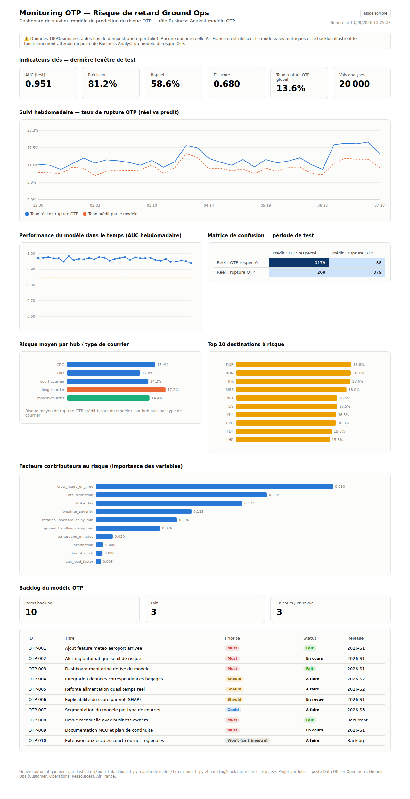

# Data Officer Operations — Ground Ops (Customer, Opérations, Ressources) — Air France

Projet portfolio construit pour illustrer les compétences attendues sur un
poste rattaché au **Data Officer des Opérations**, couvrant trois rôles
complémentaires sur le domaine de données **Ground Ops** (Customer,
Opérations, Ressources), ainsi qu'un rôle transverse de gouvernance.

> ⚠️ **Projet de démonstration.** Toutes les données utilisées sont
> synthétiques (générées par script). Aucune donnée réelle ni confidentielle
> d'Air France n'est utilisée. L'objectif est d'illustrer une méthode de
> travail et des livrables représentatifs des missions du poste.



## Les rôles couverts

| Rôle | Mission | Dossier |
|---|---|---|
| **Business Analyst — modèle OTP** | Gestion de la backlog du modèle de prédiction du risque de retard, coordination de l'alimentation avec l'IT, maintien en conditions opérationnelles, dashboard de monitoring, référent risque retard | [`otp-delay-risk/`](otp-delay-risk/) |
| **Privacy Coordinator** | Application des règlements sur les données personnelles, relais auprès de la communauté data en lien avec le DPO | [`privacy-coordinator/`](privacy-coordinator/) |
| **AI Responsible** | Application du règlement européen sur l'IA, conseil sur les déclarations obligatoires, traçabilité des usages IA | [`ai-responsible/`](ai-responsible/) |
| **Rôle transverse** | Cadrage global du poste et cohérence entre les trois rôles | [`docs/role_transverse.md`](docs/role_transverse.md) |

## Démarrage rapide

```bash
git clone <url-du-repo>
cd airfrance-groundops-data-role
python -m venv .venv && source .venv/bin/activate   # optionnel
pip install -r requirements.txt

# Pipeline du modèle OTP (données -> modèle -> dashboard)
cd otp-delay-risk
python data/generate_synthetic_data.py --n-flights 20000 --seed 42 --out data/flights_synthetic.csv
cd model && python train_model.py --data ../data/flights_synthetic.csv && cd ..
cd dashboard && python build_dashboard.py && cd ../..
```

Ouvrez ensuite `otp-delay-risk/dashboard/otp_monitoring_dashboard.html` dans
un navigateur — aucune connexion réseau ni serveur requis.

Un dashboard déjà généré est disponible directement dans le dépôt pour
consultation immédiate, sans exécuter le pipeline.

## Structure du dépôt

```
airfrance-groundops-data-role/
├── README.md                     # ce fichier
├── requirements.txt
├── docs/
│   ├── role_transverse.md        # note de cadrage du poste
│   └── assets/                   # captures d'écran
├── otp-delay-risk/                # rôle Business Analyst — modèle OTP
│   ├── data/                     # génération de données synthétiques
│   ├── model/                    # entraînement + monitoring du modèle
│   ├── backlog/                  # gestion de la backlog produit du modèle
│   └── dashboard/                # dashboard HTML de monitoring
├── privacy-coordinator/           # rôle Privacy Coordinator
│   ├── templates/                # registre des traitements, checklist
│   └── validate_registre.py      # contrôle de cohérence du registre
└── ai-responsible/                 # rôle AI Responsible
    ├── templates/                # registre des usages IA, trame de déclaration
    └── validate_registre_ia.py   # contrôle de conformité AI Act
```

## Pourquoi ce projet

Le poste combine un rôle **opérationnel/produit** (Business Analyst du modèle
OTP, au cœur de la performance Ground Ops) et deux rôles de **gouvernance et
conformité** (Privacy Coordinator, AI Responsible), sur un périmètre commun.
Ce dépôt reproduit cette logique : un pipeline data fonctionnel de bout en
bout pour le rôle le plus opérationnel, et des outils de gouvernance
(registres + scripts de contrôle) pour les deux rôles de conformité — le tout
documenté et exécutable.

Voir [`docs/role_transverse.md`](docs/role_transverse.md) pour le détail du
positionnement du poste et de la cohérence entre les trois rôles.

## Licence

Projet de démonstration à but personnel (portfolio). Aucune donnée réelle
n'est incluse.
